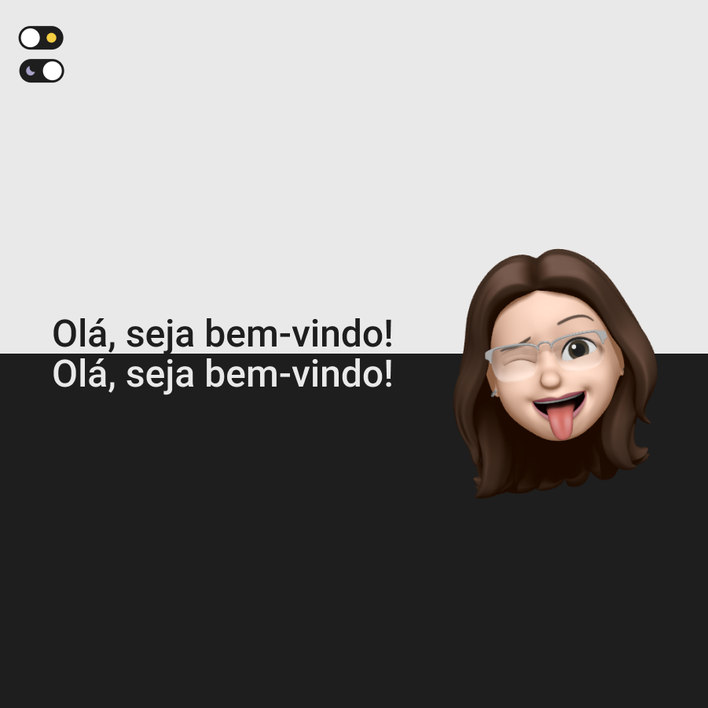

# Dark/Light Mode

Projeto desenvolvido para estudo das tecnologias HTML, CSS e JavaScript a fim de produzir um site com a opção de utiliza-lo em tema Dark ou Light  

## 💻 Projeto

- Visite o projeto em: https://darklight-mode.vercel.app

## 🖼 Imagem do Projeto

  

